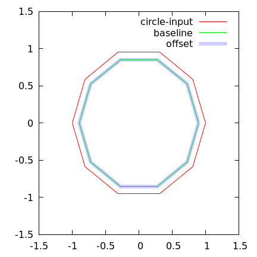
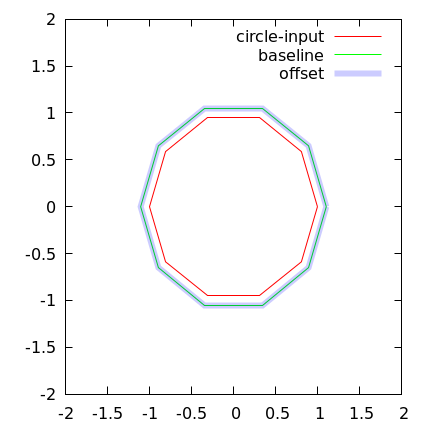
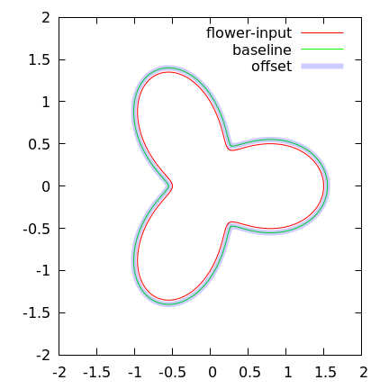

# Summary
Caveat Emptor!
A simple library that implements basic polygon offsetting (shrink and expand).  The general idea is to calculate normal vectors to the polygon line segements and offset the segements in the `+/-` direction of the normal vector.

## Examples
Offset examples:
- A circle that we shrink by 0.01

  

- A circle that we expand by 0.01

  

- A flower that we expand by 0.05

  

